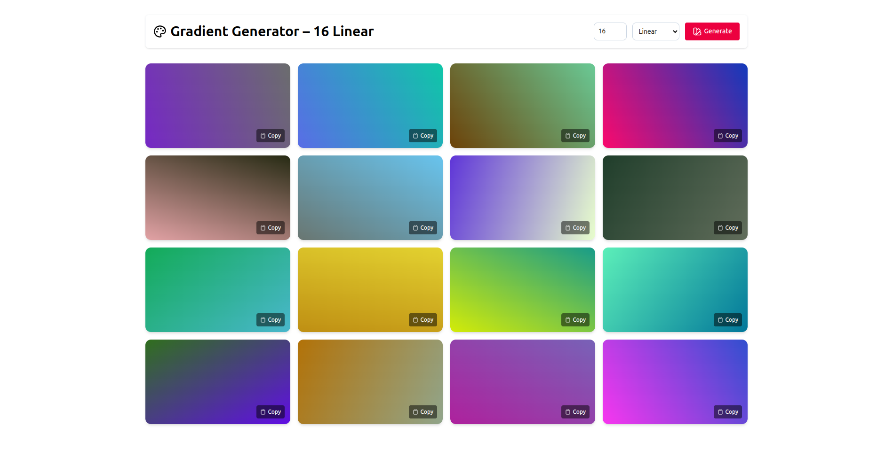

# 🎨 GradienCraft - Generate Custom Gradient Colors

A simple and responsive React app to generate random linear and radial gradients. You can choose the number of gradients, switch between gradient types, and regenerate fresh palettes with a click.

## 📸 Screenshots

## ✨ Features
* Generate random linear and radial gradients
* Adjustable number of palettes
* Random gradient angles for linear mode 
* Responsive layout (works on desktop, tablet, and mobile)
* Copy gradient styles easily for use in your projects

## 🚀 Tech Stack
* React 19 
* Tailwind CSS for styling 
* Lucide React for icons
* React Toastify for toast notifications
* Vite for fast development

## 📂 Project Structure

```bash
── src/
    ├── components/
    │   ├── GradientGenerator.jsx
    │   └── GradientCard.jsx
    ├── utils/
    │   └── colorUtils.js 
    ├── App.jsx
    └── main.jsx
```

## ⚡ Getting Started
1. Clone the repo
```bash
git clone https://github.com/yourusername/gradient-generator.git
cd gradient-generator 
```
2. Install dependencies
```bash
npm install 
```
3. Run the development server
```bash
npm run dev
```

Open http://localhost:5173 in your browser.

## 🔮 Future Improvements
* Add ability to copy gradient code with one click
* Support for multiple color stops
* Save favorite gradients to local storage

## 📝 License
This project is licensed under the MIT License. Feel free to use, modify, and share.